<div align="center">
  
  
  
</div>

<div align="center">
  <a href="https://www.linkedin.com/in/leo-stephen-maduri/"></a>
  <a href="mailto:leostephen.maduri@gmail.com"></a>
  <!-- <a href="https://your-portfolio-url.com"></a> -->
</div>

<div align="center">
  
  <p style="color:#bb86fc; font-size:12px;">🐍 Watch the snake eat my contribution graph</p>
</div>

<div align="center">
  Computer Science student specializing in <b>AI and Computational Thinking</b> at KL University (CGPA: 9.32/10.0).<br>
  Passionate about building scalable applications with microservices architecture and leveraging AI to solve complex problems.
</div>

<div align="center">
  <table style="border: none; background-color: #1a1b27; width: 100%;">
    <tr>
      <td align="center" style="background-color: #1a1b27; border: none;">
        <a href="#skills-inventory">
          <table style="border: none; border-collapse: collapse;">
            <tr>
              <td style="background-color: #1a1b27; color: white; padding: 10px 15px; border: none;">⚔️ SKILLS</td>
              <td style="background-color: #bb86fc; color: white; padding: 10px 15px; border: none;">INVENTORY</td>
            </tr>
          </table>
        </a>
      </td>
      <td align="center" style="background-color: #1a1b27; border: none;">
        <a href="#main-quests">
          <table style="border: none; border-collapse: collapse;">
            <tr>
              <td style="background-color: #1a1b27; color: white; padding: 10px 15px; border: none;">🕹️ MAIN</td>
              <td style="background-color: #bb86fc; color: white; padding: 10px 15px; border: none;">QUESTS</td>
            </tr>
          </table>
        </a>
      </td>
      <td align="center" style="background-color: #1a1b27; border: none;">
        <a href="#achievements-unlocked">
          <table style="border: none; border-collapse: collapse;">
            <tr>
              <td style="background-color: #1a1b27; color: white; padding: 10px 15px; border: none;">🏆 ACHIEVEMENTS</td>
              <td style="background-color: #bb86fc; color: white; padding: 10px 15px; border: none;">UNLOCKED</td>
            </tr>
          </table>
        </a>
      </td>
      <td align="center" style="background-color: #1a1b27; border: none;">
        <a href="#player-stats">
          <table style="border: none; border-collapse: collapse;">
            <tr>
              <td style="background-color: #1a1b27; color: white; padding: 10px 15px; border: none;">📊 PLAYER</td>
              <td style="background-color: #bb86fc; color: white; padding: 10px 15px; border: none;">STATS</td>
            </tr>
          </table>
        </a>
      </td>
    </tr>
  </table>
</div>

---

<!-- 🏆 GitHub Trophies -->
<div align="center">
  <h2>
    
    <span style="color:#bb86fc; background-color:#1a1b27; padding:0 10px; border-radius:5px;">TROPHY CABINET</span>
    
  </h2>
  
</div>

---

<div align="center">
  <h2>
    
    <span style="color:#bb86fc; background-color:#1a1b27; padding:0 10px; border-radius:5px;">SKILLS INVENTORY</span>
    
  </h2>
</div>

<!-- Languages -->
<div align="center">
  <h4>⚡ Languages</h4>
  
</div>

<!-- Frameworks & Libraries -->
<div align="center">
  <h4>🛠️ Frameworks & Libraries</h4>
  
</div>

<!-- Databases & Tools -->
<div align="center">
  <h4>🗄️ Databases & Tools</h4>
  
</div>

<!-- ⏱️ WakaTime Coding Activity -->
<div align="center">
  <h4>⏱️ Weekly Coding Activity</h4>
  
  <br>
  <sub>📊 Powered by <a href="https://wakatime.com">WakaTime</a> - <a href="https://wakatime.com/plugins">Install the plugin</a> to track your coding activity!</sub>
</div>

<!-- Inspired by Code Mode category - Code snippet -->
<details>
  <summary><b>💻 My Favorite Code Snippet</b></summary>
  
```python
def solve_problem(complexity):
    if complexity > 9000:
        return "It's over 9000!"
    
    solution = []
    while complexity > 0:
        solution.append("Think")
        solution.append("Code")
        solution.append("Debug")
        complexity -= 1
        
    return "Problem solved with " + str(len(solution)) + " steps!"
```
</details>

<div align="center">
  <h2>
    
    <span style="color:#bb86fc; background-color:#1a1b27; padding:0 10px; border-radius:5px;">RELEVANT COURSEWORK</span>
    
  </h2>
</div>

<table align="center">
  <tr>
    <td></td>
    <td></td>
    <td></td>
  </tr>
  <tr>
    <td></td>
    <td></td>
    <td></td>
  </tr>
  <tr>
    <td></td>
    <td></td>
    <td></td>
  </tr>
</table>

---

<div align="center">
  <h2>
    
    <span style="color:#bb86fc; background-color:#1a1b27; padding:0 10px; border-radius:5px;">MAIN QUESTS</span>
    
  </h2>
</div>

<table>
  <tr>
    <td align="center" width="50%" bgcolor="#1a1b27">
      <h3>PROJECT <span style="color:#bb86fc">MEDISLOT</span></h3>
      
      
      
      <br>
      
      
      
      
      
      <br><br>
      <p>🏥 <b>Healthcare Appointment System</b> with microservices architecture</p>
      <ul align="left">
        <li>Role-based authentication system (Patient, Doctor, Admin) with JWT</li>
        <li>Doctor verification workflow with document upload and admin review</li>
        <li>Real-time appointment booking with availability checking</li>
        <li>Email notification system for appointment confirmations and reminders</li>
        <li>Responsive UI with React.js, Material-UI and TailwindCSS</li>
      </ul>
      <p align="center">
        <a href="https://github.com/Leo-Stephen/MediSlot">
          
        </a>
        <br><br>
        <a href="#">
          
        </a>
      </p>
    </td>
    <td align="center" width="50%" bgcolor="#1a1b27">
      <h3>PROJECT <span style="color:#bb86fc">KISAN VISHWA</span></h3>
      
      
      
      
      <br>
      
      
      
      
      <br><br>
      <p>🌾 <b>Agricultural E-Commerce Platform</b> connecting farmers directly with consumers</p>
      <ul align="left">
        <li>Multi-user authentication system with three distinct roles (Farmers, Customers, Admins)</li>
        <li>Comprehensive product catalog with categories for agricultural goods</li>
        <li>AI-powered chatbot using Google's Gemini with role-specific responses</li>
        <li>Complete order processing with Razorpay payment integration</li>
        <li>Shopping features including cart, wishlist, and product search/filtering</li>
      </ul>
      <p align="center">
        <a href="https://github.com/Leo-Stephen/KisanVishwa">
          
        </a>
        <br><br>
        <a href="https://agriecom.pythonanywhere.com">
          
        </a>
      </p>
    </td>
  </tr>
  <tr>
    <td align="center" width="50%" bgcolor="#1a1b27">
      <h3>PROJECT <span style="color:#bb86fc">EVENT BASED SHOPPING PLANNER</span></h3>
      
      
      
      <br>
      
      
      
      <br><br>
      <p>🛒 <b>AI-Powered Shopping Intelligence Platform</b> with sophisticated local AI processing</p>
      <ul align="left">
        <li>Multi-strategy AI architecture with 100% local processing capability</li>
        <li>Advanced semantic analysis with 384-dimensional vector embeddings</li>
        <li>Enterprise-grade product curation with intelligent category grouping</li>
        <li>Premium glass morphism UI with responsive design and dark mode</li>
        <li>Sub-900ms search performance with sophisticated caching and optimization</li>
      </ul>
      <p align="center">
        <a href="https://github.com/Leo-Stephen/Sparkathon_EventBasedShoppingPlanner">
          
        </a>
        <br><br>
        <a href="https://esp-event-based-shopping-planner.vercel.app/">
          
        </a>
        <br><br>
        <a href="#">
          
        </a>
      </p>
    </td>
  </tr>
</table>

<!-- Inspired by Fancy Fonts category -->
<div align="center">
  
</div>

---

<div align="center">
  <h2>
    
    <span style="color:#bb86fc; background-color:#1a1b27; padding:0 10px; border-radius:5px;">ACHIEVEMENTS UNLOCKED</span>
    
  </h2>
</div>

<table>
  <tr>
    <td align="center" bgcolor="#1a1b27">
      <h3><span style="color:#bb86fc">SMART INDIA HACKATHON 2023</span></h3>
      
      <br><br>
      <p>🏆 <b>Malicious Mobile Application Detection Solution</b></p>
      <ul align="left">
        <li>Led team OSS IRIS in the national-level hackathon</li>
        <li>Developed a real-time network traffic monitoring system using OSINT feeds</li>
        <li>Recognized by the Ministry of Power, Government of India</li>
        <li>Implemented IP and URL analysis for detecting malicious connections</li>
        <li>Created automated alert system with email and push notifications</li>
        <li>Built features for packet dropping, whitelist management, and APK analysis</li>
      </ul>
      <p align="center">
        
      </p>
    </td>
  </tr>
</table>

<!-- Additional achievements can be added in the same format -->

<!-- Inspired by Badges category - Achievement badges -->
<div align="center">
  
</div>

---

<div align="center">
  <h2>
    
    <span style="color:#bb86fc; background-color:#1a1b27; padding:0 10px; border-radius:5px;">PLAYER STATS</span>
    
  </h2>
</div>

<!-- Developer Quote -->
<div align="center">
  
</div>

<!-- GitHub Stats Cards - Row 1 -->
<div align="center">
  <table>
    <tr>
      <td width="50%">
        <div style="background-color: #1a1b27; border-radius: 6px; padding: 16px; color: white; text-align: center;">
          <h3 style="color: #bb86fc; text-align: center;">CONTRIBUTION ACTIVITY</h3>
          <a href="https://github.com/Leo-Stephen">
            
          </a>
          <p style="font-size: 12px; margin-top: 8px; color: #bb86fc;">
            Visualizing contribution frequency over time
          </p>
        </div>
      </td>
      <td width="50%">
        <a href="https://github.com/DenverCoder1/github-readme-streak-stats">
          
        </a>
      </td>
    </tr>
  </table>
</div>

<!-- GitHub Metrics - Comprehensive Stats -->
<div align="center">
  <h2>
    
    <span style="color:#bb86fc; background-color:#1a1b27; padding:0 10px; border-radius:5px;">DETAILED METRICS</span>
    
  </h2>
  
</div>

<!-- GitHub Badges -->
<div align="center">
  
  
  
  
</div>

<!-- Octocat - Fixed to not expand entire row -->
<div align="center" style="max-width: 200px; margin: 0 auto;">
  
</div>

---

<!-- Improved Game Over ASCII Art with color -->
<div align="center">
  <div style="background-color: #1a1b27; border-radius: 10px; padding: 20px; max-width: 800px; margin: 0 auto; border: 2px solid #bb86fc;">
    <pre style="color: #bb86fc; font-family: 'Courier New', monospace; text-align: center; margin: 0;">
╔══════════════════════════════════════════════════════════════════════════════╗
║                                                                              ║
║   <span style="color: #ff79c6;">██████╗  █████╗ ███╗   ███╗███████╗     ██████╗ ██╗   ██╗███████╗██████╗</span>  ║
║  <span style="color: #ff79c6;">██╔════╝ ██╔══██╗████╗ ████║██╔════╝    ██╔═══██╗██║   ██║██╔════╝██╔══██╗</span> ║
║  <span style="color: #ff79c6;">██║  ███╗███████║██╔████╔██║█████╗      ██║   ██║██║   ██║█████╗  ██████╔╝</span> ║
║  <span style="color: #ff79c6;">██║   ██║██╔══██║██║╚██╔╝██║██╔══╝      ██║   ██║╚██╗ ██╔╝██╔══╝  ██╔══██╗</span> ║
║  <span style="color: #ff79c6;">╚██████╔╝██║  ██║██║ ╚═╝ ██║███████╗    ╚██████╔╝ ╚████╔╝ ███████╗██║  ██║</span> ║
║   <span style="color: #ff79c6;">╚═════╝ ╚═╝  ╚═╝╚═╝     ╚═╝╚══════╝     ╚═════╝   ╚═══╝  ╚══════╝╚═╝  ╚═╝</span> ║
║                                                                              ║
║                     <span style="color: #50fa7b; font-weight: bold;">[ PRESS CONTINUE TO PLAY ]</span>                     ║
║                                                                              ║
╚══════════════════════════════════════════════════════════════════════════════╝
    </pre>
  </div>
</div>

<!-- Improved Retro Footer -->
<div align="center">
  <div style="background-color: #1a1b27; border-radius: 10px; padding: 15px; max-width: 600px; margin: 20px auto; border: 2px solid #bb86fc;">
    <pre style="color: #8be9fd; font-family: 'Courier New', monospace; text-align: center; margin: 0;">
┌───────────────────────────────────────────────┐
│                                               │
│   <span style="color: #f1fa8c;">Thanks for visiting my GitHub profile!</span>      │
│   <span style="color: #f1fa8c;">Let's connect and build something awesome.</span>  │
│                                               │
└───────────────────────────────────────────────┘
     <span style="color: #ff79c6; font-weight: bold;">⬆️ ⬆️ ⬇️ ⬇️ ⬅️ ➡️ ⬅️ ➡️ 🅱️ 🅰️ START</span>
    </pre>
  </div>
</div>
